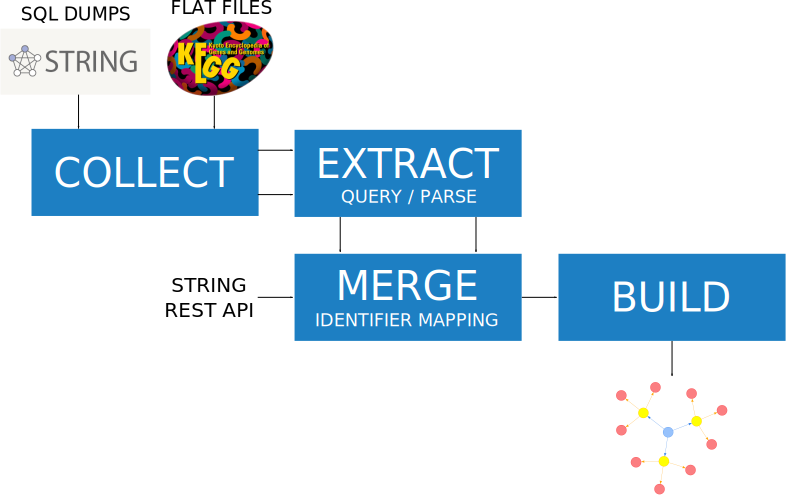

 

# 1. Collect the data

- Download the STRING database dumps
    - Full database
        - [database.schema.v10.5.pdf](https://stringdb-static.org/download/database.schema.v10.5.pdf) (121.3 kB) - Database scheme
        - [items_schema.v10.5.sql.gz](https://stringdb-static.org/download/items_schema.v10.5.sql.gz) (4.9 GB) - part I: the players (proteins, species, COGs,...)
        - [network_schema.v10.5.sql.gz](https://stringdb-static.org/download/network_schema.v10.5.sql.gz) (41.3 GB) - part II: the networks (nodes, edges, scores,...)
        - [evidence_schema.v10.5.sql.gz](https://stringdb-static.org/download/evidence_schema.v10.5.sql.gz) (6.9 GB) - part III: interaction evidence (but: excluding license-restricted data, such as **KEGG pathways**)
- Load the dumps into a main PostgreSQL database (Stefan)
- [Download KEGG data for a certain species](documentation#downloading-kegg-data-for-a-certain-species)

partially automated

# 2. Load a subset of STRING data locally
- Dump the data for species we are interested in (e.g. for _Homo sapiens_ or _Mus musculus_) from the main database (using [pg_dump_sample](https://github.com/dankeder/pg_dump_sample) and e.g. [dump_manifest.human.yml](https://github.com/BackofenLab/protein-graph-database/blob/master/sql/dump_manifest.human.yml))
    - Database subsets
        - _Mus musculus_ (mouse): [STRING_mouse.zip](https://drive.google.com/file/d/1-AL0M7KPqCGXETL9BTsFGFbj6FqoQPMB/view?usp=sharing) (131 MB)
        - _Homo sapiens_ (human): [STRING_human.zip](https://drive.google.com/file/d/11B4HgG_O5dKj7ig-dIqAwViV0lZ4sabI/view?usp=sharing) (117 MB)
- Load the dumps for each species separately into a local PostgreSQL database

not automated

<u>The following steps are executed per species:</u>

# 3. Extract the information from the data

- Derive the information we are interested in
    - Query the local PostgreSQL database from STRING
    - Parse the downloaded KEGG PATHWAY data

automated (testing)

# 4. [Merge KEGG PATHWAY and STRING](KEGG)

automated (testing)

# 5. [Build a graph database](documentation#building-a-neo4j-graph-database)

- Turn the extracted information into [Neo4j](https://neo4j.com/) graph database (using our defined [database scheme](graph-db-scheme))
    - Example: Neo4j database dump for _Homo sapiens_ (human): [neo4j_human.dump](https://drive.google.com/file/d/1LpKRevT_hUy5_-0Q6EnWcU-unsXuJ_I-/view?usp=sharing) (1.2 GB)
- Build the graph for multiple species in the same database (add species attribute to each node)
- Visualize the graph database

automated (testing)

 

 

# 6. Use machine learning

- Do a classfication / functional prediction of various proteins

not automated

